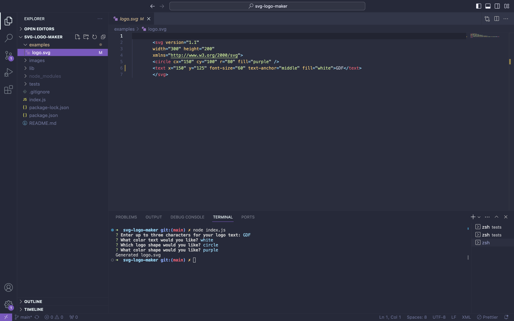

# svg-logo-maker

## Description
The SVG Logo-Generator is a command-line application that takes in user input to generate a logo and save it as an svg file. The user is prompted for the text, text color, shape, and shape color of the logo. The colors can be entered as a keyword or a hexadecimal number. Once generated, the logo will be a 300x200 pixel image. 
Technologies used to create this application are node.js, inquirer, and jest. 

## Installation
To install this application, you will need to install node.js. Then, after cloning the repository, enter the following command into the integrated terminal to install inquirer:
```npm install```.   
The application can be invoked by using the following command:
```node index.js```

## Usage

Watch the walkthrough video [here](https://drive.google.com/file/d/1tmuCJPJDVhIl4O_AIcCR6GwOxsiUM0qY/view).



## License
None